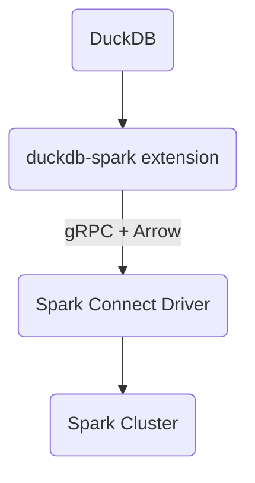
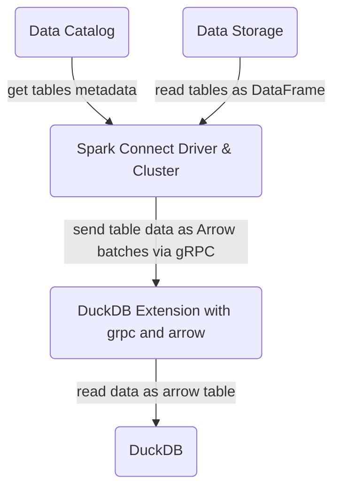
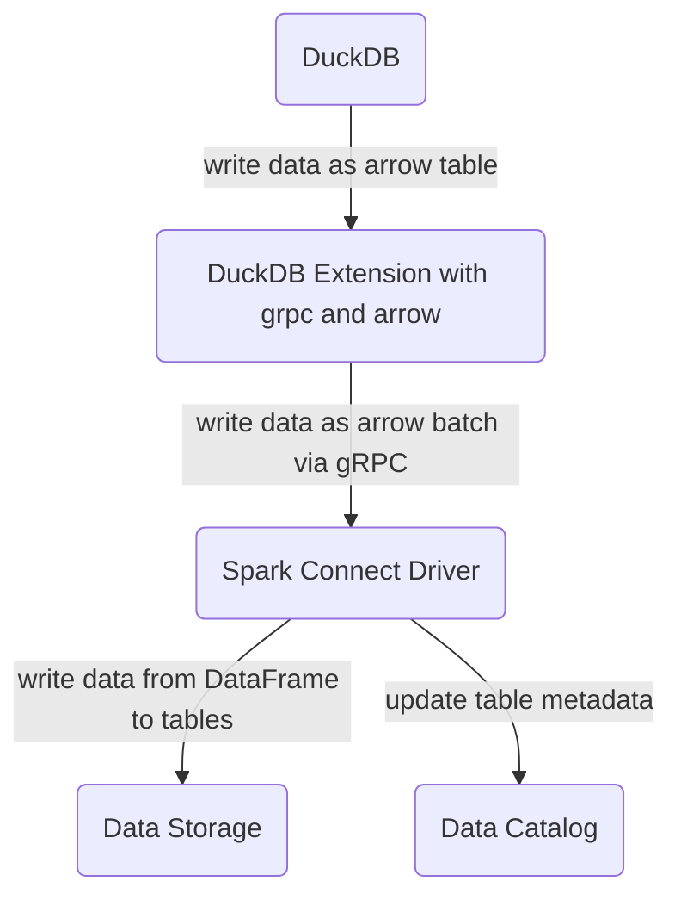

# DuckDB - Spark Extension
## Introduction
DuckDB extension to connect to Spark via Spark Connect API - so DuckDB can tap into the ecosystem of Spark.

The vision of this project is creating hybrid data processing systems, combine the strength of both distributed computing (scalable) and local computing (blazing fast).

## Overall Design

### Overview

The `duckdb-spark`
extension stand between DuckDB and Spark Connect Driver, allow DuckDB to utilized resources of scalable distributed Spark clusters and connect to broad range of data systems (Cloudera, Databricks, etc) and lakehouse (Apache Iceberg, Delta Lake, Apache Hudi, Apache Paimon, etc) to explore, analyze data without caring much about underlying details of storage or table format.

The reasons why this project works are:

1. Spark Connect API, built on 2 amazing language-agnostic technologies: gRPC and Apache Arrow in-memory columnar data format
2. DuckDB integration with Apache Arrow: zero-copy data access and conversion from DuckDB data format to Arrow RecordBatch

### The read path

### The write path

## Documentation
- [Extension Docs](./docs/README.md)
